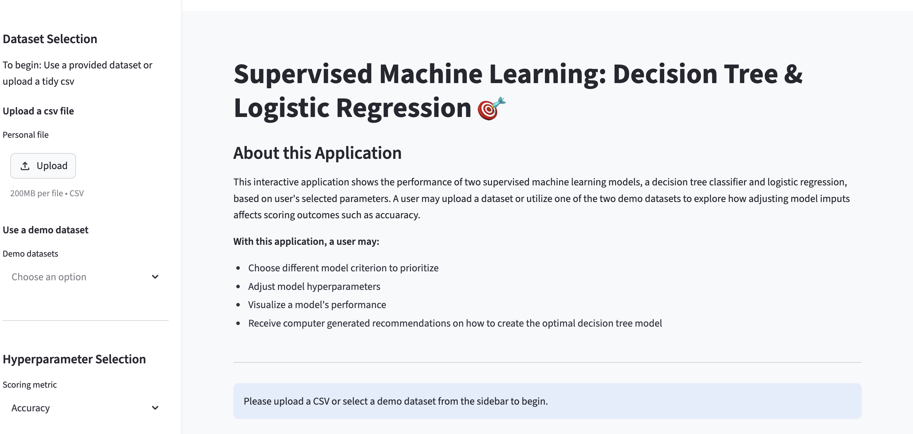
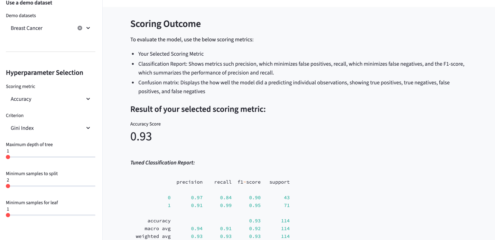

### Description:
This folder encompasses all files for my Supervised Machine Learning Application Project. 
My app shows the performance of two supervised machine learning models (a decision tree classifier and logistic regression) based on user's selected model attributes.
The app allows users to upload their own dataset or use provided demo datasets to observe how altering hyperparameters impacts model training and performance. 

### App Features: 
Decision tree and logistic regression models are utilized to predict outcomes using a dataset. Decision tree models use dataset features to split data into branches. They continue splitting data until reaching a final prediction or outcome. They are non-linear. Logistic regression models find the probability of a specific outcome happening by running a curve through data points. Unlike decision tree models, they are linear.

Within the application, users have the ability to choose different scoring metrics to measure their model as well as criterion. Scoring metric options include accuracy, F1 score, precision, and recall. Criterion options includes gini index, log loss, and entropy. Users may also adjust the hyperparameters of their decision tree models (the maximum tree depth, minimum number of samples to conduct a split, and the minimum samples for a leaf). Users may personalize their model using sliders and drop-down boxes on the application's side bar.

### Data: 
The provided demo datasets, ["Breast Cancer"](https://scikit-learn.org/stable/modules/generated/sklearn.datasets.load_breast_cancer.html) and ["Wine"](https://scikit-learn.org/stable/modules/generated/sklearn.datasets.load_wine.html), are sourced from scikit-learn. The Breast Cancer dataset contains information regarding maligment and beign tumors. It possesses variables such as "mean radius,"
"mean texture", and "mean perimeter". The Wine dataset contains information regarding three different wine classes and their individual characteristics. It contains variables such as "alcohol", "ash", and "malic acid".

### Directions on how to run the streamlit app: 
To run the app locally:
1. Download the MLStreamlitApp folder.
2. Make sure you have streamlit, pandas, numpy, seaborn, matplotlib, scikit-learn, and graphviz installed within your python environment.
3. Enter "streamlit run app_mainfile.py" into your terminal. 

You may also run the app via this ["link"](https://ellef845-ford-data-science-po-mlstreamlitappapp-mainfile-8u7d8n.streamlit.app/). 

### References: 
For project references, I used ["Data Wrangling with pandas Cheat Sheet"](https://pandas.pydata.org/Pandas_Cheat_Sheet.pdf) made by http://pandas.pydata.org as well as course notes on ["logistic regression"](https://github.com/ellef845/Ford-Data-Science-Portfolio/blob/main/week_nine/IDS%20Week%209_1_FINAL.ipynb) and ["decision tree classifiers"](https://github.com/ellef845/Ford-Data-Science-Portfolio/blob/main/week_ten/IDS%20Week%2010_2_FINAL.ipynb) created by David Smiley. I also utilized scikit-learn documentation for functions such as a ["label_binarize"](https://scikit-learn.org/stable/modules/generated/sklearn.preprocessing.label_binarize.html). 

### Visualizations of the Application

#### *Main Page*
 

 

---

 

#### *Decision Tree Scoring Results*

