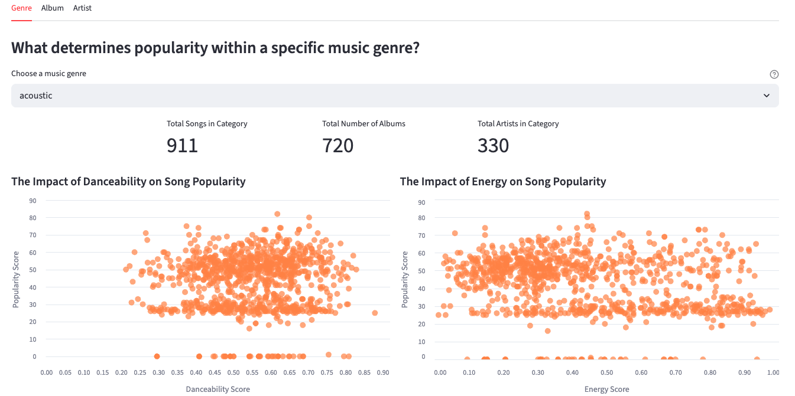
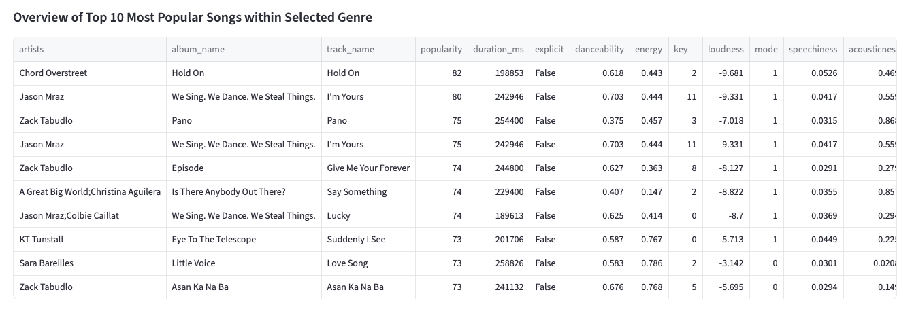

### Description:

This folder encompasses all files for my basic streamlit app. My app, "What Drives a Hit on Spotify?", allows users to see how danceability and energy affect a song's popularity. Utilitizing page tabs and filters, users can visualize danceability's and energy's impact on popularity by music genre, album, or artist/artist group. This project exemplifies proficiency in Python and the development of an interactive webpage in Streamlit. 

### Data: 
My app utilizes a Kaggle dataset titled "Spotify Tracks Dataset" which describes the musical characteristics of around 89,000 songs. It includes features such as artist name, album name, track name, popularity, danceability, energy, and musical key. 

### Directions on how to run the app: 
To run the app locally: 

1. Download the basic_streamlit_app folder.
2. Make sure you have streamlit installed within your python environment.
3. Go into your python terminal and give the command "streamlit run basic_streamlit_app/main.py".

You may also run the app via this ["link"](https://ellef845-ford-data-science-portf-basic-streamlit-appmain-xuxyx6.streamlit.app/).

### Visualization Examples

#### *Dancebility and Energy*
 

 

---

 

#### *Top Ten Most Popular Songs*

